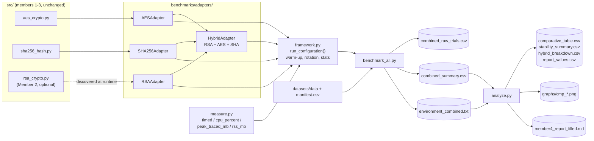

# IE3082 Cryptography – Member 4: Benchmarking + Integration + Comparative Analysis

**Student:** _name (student ID)_ · **Module:** IE3082 Cryptography, SLIIT, Y3S2 2026

This component benchmarks **all of the group's algorithms with a single method** and compares them.
AES-GCM (Member 1), RSA (Member 2) and SHA-256 (Member 3) are wrapped in thin adapters. One runner
measures them on the same inputs using the same `benchmarks/measure.py` helpers as the per-component
benchmarks, and one analysis script turns the results into tables, figures and report values.
Every number comes from the generated CSVs. Nothing is typed in by hand.

> **RSA status:** the adapter plugs in the RSA module automatically once it exists in `src/`
> (see [Adding RSA](#adding-rsa-member-2)). Until then RSA and the hybrid scenario are skipped with a
> warning, and the AES-GCM and SHA-256 results are still produced.

## Architecture



| File | Role |
|---|---|
| `benchmarks/framework.py` | `AlgorithmAdapter` / `Operation` interface, generic runner, statistics (mean, min, max, sample SD, CV, 95 % CI, throughput), CSV schema |
| `benchmarks/adapters/aes_adapter.py` | AES-128/192/256-GCM encrypt/decrypt via `src/aes_crypto.py` |
| `benchmarks/adapters/sha256_adapter.py` | SHA-256 `hash_bytes` via `src/sha256_hash.py`, checked against `manifest.csv` |
| `benchmarks/adapters/rsa_adapter.py` | finds the RSA module and maps its functions; keygen, OAEP encrypt/decrypt, sign/verify; enforces the OAEP input limit |
| `benchmarks/adapters/hybrid_adapter.py` | RSA-wrapped AES-256 key + AES-GCM + SHA-256, each step timed |
| `benchmarks/benchmark_all.py` | unified runner (CLI) |
| `benchmarks/analyze.py` | tables, stability check, figures, report values, filled report draft |
| `tests/test_framework.py` | 35 tests: statistics, adapters, runner, RSA skip/plug-in, schema, `--quick` end to end |
| `docs/member4_report_draft.md` | report sections with `{{PLACEHOLDERS}}` filled from the CSVs |

## How to run (Windows PowerShell, project root, venv active)

```powershell
python -m datasets.generate_test_data           # 1. inputs (skip if datasets\data exists)
python -m pytest -v                              # 2. all tests (AES + SHA-256 + framework)
python -m benchmarks.benchmark_all --quick       # 3. ~10 s smoke test -> results\quick\ (git-ignored)
python -m benchmarks.analyze --results results\quick
python -m benchmarks.benchmark_all               # 4. FULL run -> results\combined_*.csv
python -m benchmarks.analyze                     # 5. tables + graphs + results\member4_report_filled.md
```

Before the full run, follow the reproducibility checklist in [README.md](README.md): AC power, *Best performance*
power mode, other applications closed. `environment_combined.txt` records the power state. Do not use a run made on
battery for the report. A full run of all four file types takes roughly 10–15 minutes. Most of that time is the
separate CPU runs (0.25 s per operation per trial). `--types BIN` is about four times faster.

### `benchmark_all` options

| Option | Default | Meaning |
|---|---|---|
| `--algorithms` | `aes sha256 rsa hybrid` | adapters to run. RSA and hybrid are skipped with a warning if no RSA module exists |
| `--types` | `BIN TXT PDF JPG` | dataset types for the size sweep |
| `--sizes` | `1KB 100KB 1MB 5MB 10MB 50MB` | dataset sizes for the size sweep |
| `--small-sizes` | `32 190` | head-to-head payloads in bytes (32 B = an AES-256 key, 190 B = the RSA-2048 OAEP limit) |
| `--hybrid-sizes` / `--hybrid-type` | `1KB 1MB 10MB` / `BIN` | files for the hybrid scenario |
| `--trials` | `10` | measured trials. **Minimum 10**, except with `--quick` |
| `--warmup` | `1` | discarded warm-up runs per configuration |
| `--cpu-window` | `0.25` | seconds per CPU measurement (0.05 with `--quick`) |
| `--out` | `results/` | output folder |
| `--quick` | – | 3 trials, BIN 1KB/1MB, hybrid 1KB, output to `results/quick/`. **Not for the report** |

### `analyze` options

`--results DIR` (default `results/`), `--file-type BIN` (type used in the size figures), `--rep-size 10MB`
(size used in the CPU and CI figures; falls back to the largest size present), `--table-sizes 1KB 1MB 10MB 50MB`,
`--template docs/member4_report_draft.md`.

## Fair-comparison design

AES, RSA and SHA-256 do different jobs, so they are not compared on a single "speed" number. Four scenarios
each answer a question that can be answered fairly:

| Scenario | Who | Question it answers |
|---|---|---|
| `size_sweep` | AES-128/192/256-GCM, SHA-256 | How do time and throughput scale over the shared datasets (4 types × 1 KB–50 MB)? |
| `small_payload` | all, on the **same bytes** (32 B, 190 B) | How do the primitives compare at a size every one of them can process? |
| `keygen` | RSA-2048/3072 | What does an RSA key pair cost? (An AES key is 32 random bytes: its cost is a row of the hybrid table.) |
| `hybrid` | RSA + AES-256-GCM + SHA-256 | Where does the time go when the three are combined as real systems combine them? |

- **RSA is not in the size sweep.** RSA-OAEP encrypts at most *k* − 2·32 − 2 bytes per operation
  (190 B for RSA-2048, 318 B for RSA-3072, with SHA-256). Encrypting a 50 MB file with RSA would mean chunking it,
  which no real system does. The runner skips any size-limited operation above the limit and lists it in
  `environment_combined.txt`.
- **Same payload, same order rules.** All algorithm/variant pairs of a configuration share the payload. Their order
  rotates by one position each trial, so drift (heat, turbo, background load) is spread over all of them.
- **In-memory for everyone.** AES timing never includes file I/O, so SHA-256 is timed with `hash_bytes()` on the
  same in-memory bytes. That matches the `inmemory_*` columns of `sha256_summary.csv`. File-based hashing stays
  in Member 3's benchmark.
- **Correctness on every trial:** AES decrypt must equal the input, and the ciphertext must be the input length plus
  the 16-byte tag. The SHA-256 digest must equal the `manifest.csv` reference. RSA decrypt must equal the input,
  the signature must verify, and a forged signature must be rejected. For the hybrid scenario, the unwrapped key must
  equal the AES key, the decrypted file must equal the input, and the receiver digest must equal the sender digest.

## Method (identical to the AES / SHA-256 benchmarks)

Per configuration: 1 warm-up per algorithm/variant (discarded), then N ≥ 10 trials. Per trial and variant:

1. `setup()` with a fresh key (AES key, RSA key pair), outside the timed region.
2. Each operation timed once with `measure.timed`: `perf_counter`, GC disabled during the call.
3. The correctness check.
4. A separate `tracemalloc` run per operation (`measure.peak_traced_mb`).
5. A separate CPU run per operation (`measure.cpu_percent`: `QueryProcessCycleTime` on Windows, psutil elsewhere,
   % of one logical core).
6. Process RSS.

Statistics per operation: mean, min, max, sample SD (n − 1), CV = SD/mean, the 95 % CI half-width
t₀.₉₇₅,ₙ₋₁ · SD/√n, and throughput = MB/mean time (1 MB = 1,048,576 B). Configurations with CV > 10 % are
flagged in `stability_summary.csv`.

## Output schema

`combined_summary.csv` has one row per (scenario, variant, operation, file type, size):

| Column | Unit / meaning |
|---|---|
| `scenario` | `keygen`, `small_payload`, `size_sweep`, `hybrid` |
| `algorithm`, `variant`, `category` | e.g. `AES-GCM`, `AES-256`, `symmetric` (`asymmetric`, `hash`, `hybrid`) |
| `operation` | `encrypt`, `decrypt`, `hash`, `keygen`, `sign`, `verify`, or a hybrid step |
| `file_type`, `size_label`, `size_bytes` | input. Keygen rows have no payload (`size_bytes` = 0) |
| `trials` | measured trials |
| `mean_ms`, `min_ms`, `max_ms`, `sd_ms` | ms; SD is the sample SD (n − 1) |
| `cv` | coefficient of variation, **% of the mean** |
| `ci95` | half-width of the 95 % confidence interval of the mean, **ms** |
| `throughput_mbps` | **MB/s** (1 MB = 1,048,576 B), same unit as `*_MBps` in the AES/SHA CSVs. Empty for operations without a payload |
| `cpu_pct_mean`, `cpu_pct_sd` | % of one logical core |
| `peak_mem_mb` | mean `tracemalloc` peak per operation, MB |
| `rss_mb` | mean process RSS, MB |
| `correctness` | `PASS 10/10` or `FAIL k/10` |

`combined_raw_trials.csv` has one row per trial and operation (`time_ms`, `cpu_pct`, `cpu_os_pct` (the psutil
value), `peak_mem_mb`, `rss_mb`, `verified`, and `order_position` from the rotation).

## Adding a new algorithm adapter

1. Create `benchmarks/adapters/<name>_adapter.py` with a subclass of `AlgorithmAdapter`. Import only the
   algorithm's module from `src/`. No measurement code goes in the adapter.

   ```python
   class ChaChaAdapter(AlgorithmAdapter):
       name, category = "ChaCha20-Poly1305", "symmetric"
       variants = property(lambda self: ("ChaCha20",))
       def operations(self, variant, scenario):
           if scenario not in (SIZE_SWEEP, SMALL_PAYLOAD):
               return []
           return [Operation("encrypt", lambda ctx, d: partial(ctx["c"].encrypt, ctx["n"], d, None)),
                   Operation("decrypt", lambda ctx, d: partial(ctx["c"].decrypt, ctx["n"], ctx["outputs"]["encrypt"], None))]
       def setup(self, variant, data, meta):          # untimed; fresh key per trial
           return {"c": ChaCha20Poly1305(ChaCha20Poly1305.generate_key()), "n": os.urandom(12)}
       def verify(self, ctx, data, outputs):
           return outputs["decrypt"] == data
   ```

   `Operation.bind(ctx, data)` returns the zero-argument callable that is timed. Outputs of earlier
   operations are in `ctx["outputs"]`. Set `bulk=False` for operations without a payload (no throughput), and
   `size_limited=True` together with `max_input_size()` for operations with an input limit.
2. Register it in `benchmarks/adapters/__init__.py` (`ADAPTER_NAMES` and `build_adapters`).
3. Optionally give it a style in `analyze.ENTITY` (colour, marker, hatch). Unknown variants get a neutral grey.
4. Add a test in `tests/test_framework.py`. `test_adapter_interface` shows the minimum.

## Adding RSA (Member 2)

Put the RSA module at `src/rsa_crypto.py`. `rsa_oaep.py`, `rsa_cipher.py` and `rsa.py` are also found. Use these
names; the listed aliases are accepted as well:

| Role | Signature | Aliases |
|---|---|---|
| key generation | `generate_keypair(bits) -> (private_key, public_key)` (or a private key with `.public_key()`) | `generate_key_pair`, `generate_keys`, `generate_rsa_keypair` |
| encryption (OAEP) | `encrypt(public_key, plaintext: bytes) -> bytes` | `rsa_encrypt`, `encrypt_data`, `oaep_encrypt` |
| decryption | `decrypt(private_key, ciphertext: bytes) -> bytes` | `rsa_decrypt`, `decrypt_data`, `oaep_decrypt` |
| signing (optional) | `sign(private_key, message: bytes) -> bytes` | `rsa_sign`, `sign_data` |
| verification (optional) | `verify(public_key, message, signature) -> bool` (or `None` + raise on failure) | `rsa_verify`, `verify_signature` |
| key sizes (optional) | `VALID_KEY_SIZES = (2048, 3072)` | `KEY_SIZES`, `SUPPORTED_KEY_SIZES` |
| input limit (optional) | `max_plaintext_size(bits) -> int` (default *k* − 66, OAEP with SHA-256) | `max_message_size` |

Check that it is detected: `python -m benchmarks.benchmark_all --quick --algorithms rsa hybrid`. The first lines say
either which module was used or exactly which function is missing. If the functions have other names or argument
orders, add a few-line wrapper to the RSA module rather than editing the adapter.

## Limitations

Documented in `docs/member4_report_draft.md`, section *Limitations*: a single machine, Python call overhead at
small sizes, OS scheduling noise, the RSA input limit, `tracemalloc` seeing only Python allocations, and the one-shot
AES API holding whole files in RAM.
